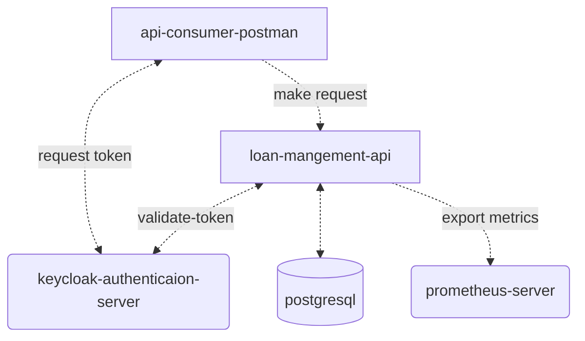

# **Loan Managent API** :moneybag:

## **About The Project** :mag:

This is a study project that simulates an api that manage loans. A previous knowledge about finances, loans and mathematics are necessary to fully understand this application

## **Getting Started** :mega:

### **Project Structure** :file_folder:
- /cmd: contains all files that start the application
- /configs: contains all configurations files
- /deploy: contains all files realated to all external things that are needed to app do run
- /internal: contains the api source codes that can't be exposed
- /test: constains all files and source codes that are needed only to test 

### **Project Architeture** :triangular_ruler:



### **Running the application** :computer:

To test this application first you need to start the docker-compose located at **/deploy/docker** folder

```bash
docker-compose up -d 
```

Then you can run the API, using the following command in the **/cmd** folder

```bash
go run .
```

To test you can import the postman collection located at **/deploy/postman**. There you will find all requests tha can be called to the API.

### **API Routes** :busstop:

At this moment, this api expose the following routes: 

- **POST** `/funding-calculator/simulate` Simulates a Loan. It will only calculate the values and return (Unauthorized)
- **POST** `/funding-calculator/{user-id}/contract` Calculate and creates a new loan (Require Authentication and Authorization)
- **GET** `/funding-calculator/{user=id}/find/{loan-id}` Find a loan by its ID (Require Authentication and Authorization)
- **GET** `/funding-calculator/{user-id}/find-all` Find all loans (Require Authentication and Authorization)
  
### **Authentication and Authorization** :lock:

The API uses keycloak as Authentication and Authorization server. 

To the routes that need Authorization you will need to generate the token with the same user that you are using in the request, or use a token generated with the loan-admin user. 

The following users are created by default: 

- test-user: simple user test 
- loan-admin: super user 

You can create more to test directly on keycloak GUI under the **"loan"** realm at http://localhost:8989/

### **Metrics** :chart_with_upwards_trend:

The API also export some prometheus metrics on the following route: http://localhost:8080/metrics

## **External Libs** :hammer:

- github.com/Nerzal/gocloak/v13 v13.8.0
- github.com/ThiagoDonadel/loan-calculator v1.0.1
- github.com/gin-gonic/gin v1.9.1
- github.com/prometheus/client_golang v1.18.0
- github.com/spf13/viper v1.16.0
- github.com/stretchr/testify v1.8.4
- go.uber.org/zap v1.24.0
- gorm.io/driver/postgres v1.5.2
- gorm.io/gorm v1.25.2